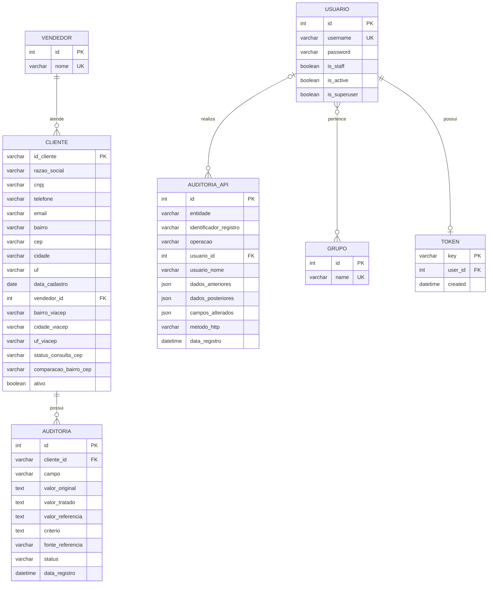

# Diagrama Entidade-Relacionamento

Projeto Primora — Distribuidora Vetor

```mermaid
erDiagram

    VENDEDOR ||--o{ CLIENTE : atende

    CLIENTE ||--o{ AUDITORIA : possui

    USUARIO o|--o{ AUDITORIA_API : realiza

    USUARIO }o--o{ GRUPO : pertence

    USUARIO ||--o| TOKEN : possui

    VENDEDOR {
        int id PK
        varchar nome UK
    }

    CLIENTE {
        varchar id_cliente PK
        varchar razao_social
        varchar cnpj
        varchar telefone
        varchar email
        varchar bairro
        varchar cep
        varchar cidade
        varchar uf
        date data_cadastro
        int vendedor_id FK
        varchar bairro_viacep
        varchar cidade_viacep
        varchar uf_viacep
        varchar status_consulta_cep
        varchar comparacao_bairro_cep
        boolean ativo
    }

    AUDITORIA {
        int id PK
        varchar cliente_id FK
        varchar campo
        text valor_original
        text valor_tratado
        text valor_referencia
        text criterio
        varchar fonte_referencia
        varchar status
        datetime data_registro
    }

    AUDITORIA_API {
        int id PK
        varchar entidade
        varchar identificador_registro
        varchar operacao
        int usuario_id FK
        varchar usuario_nome
        json dados_anteriores
        json dados_posteriores
        json campos_alterados
        varchar metodo_http
        datetime data_registro
    }

    USUARIO {
        int id PK
        varchar username UK
        varchar password
        boolean is_staff
        boolean is_active
        boolean is_superuser
    }

    GRUPO {
        int id PK
        varchar name UK
    }

    TOKEN {
        varchar key PK
        int user_id FK
        datetime created
    }
```

